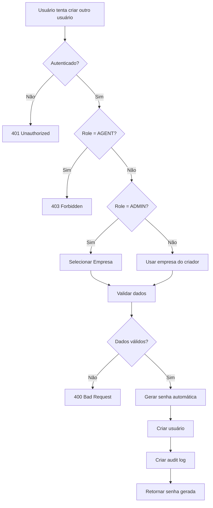

# 🔐 RBAC - Sistema de Permissões

Role-Based Access Control (Controle de Acesso Baseado em Funções)

---

## 📋 Visão Geral

O Performancy utiliza um sistema RBAC com **4 níveis hierárquicos** de acesso:

```
ADMIN (Staff Performancy)
  └── Acesso a TODAS empresas
      └── DIRECTOR (Cliente - Nível Empresa)
          └── Acesso total à própria empresa
              └── MANAGER (Gerente de Squad)
                  └── Acesso aos squads que gerencia
                      └── AGENT (Vendedor/SDR)
                          └── Acesso apenas aos próprios dados
```

---

## 👥 Roles Detalhadas

### 🔴 ADMIN
**Quem:** Staff da Performancy (equipe interna)

**Acesso:**
- ✅ Todas as empresas no sistema
- ✅ Painel administrativo (`/admin`)
- ✅ Criar usuários em qualquer empresa
- ✅ Ver custos de IA
- ✅ Gerenciar feature flags

**Restrições:**
- ❌ Não pode ser criado via API (apenas manualmente)
- ❌ Requer `company_id` ao criar usuários

**Helpers:**
```ts
can_access_admin(role) // true apenas para ADMIN
can_view_ai_costs(role) // true apenas para ADMIN
```

---

### 🟠 DIRECTOR
**Quem:** Diretor/Executivo da empresa cliente

**Acesso:**
- ✅ Todos dados da própria empresa
- ✅ Criar usuários na empresa
- ✅ Gerenciar integrações
- ✅ Configurações da empresa
- ✅ Ver todos squads
- ✅ Ver performance de todos vendedores

**Restrições:**
- ❌ Não vê dados de outras empresas
- ❌ Não acessa painel admin
- ❌ Não pode criar usuários ADMIN

**Helpers:**
```ts
can_create_user(role) // true
can_manage_integrations(role) // true
can_edit_company_settings(role) // true
```

---

### 🟡 MANAGER
**Quem:** Gerente de squad/time

**Acesso:**
- ✅ Dados dos squads que gerencia
- ✅ Criar usuários na empresa
- ✅ Editar playbooks
- ✅ Gerenciar bots
- ✅ Ver performance do time
- ✅ Exportar dados

**Restrições:**
- ❌ Não vê squads de outros managers
- ❌ Não gerencia integrações
- ❌ Não altera configurações da empresa
- ❌ Não pode criar usuários ADMIN

**Helpers:**
```ts
can_create_user(role) // true
can_manage_team(role) // true
can_edit_playbook(role) // true
can_manage_bots(role) // true
```

---

### 🟢 AGENT
**Quem:** Vendedor, SDR, representante comercial

**Acesso:**
- ✅ Apenas seus próprios dados
- ✅ Suas conversas e deals
- ✅ Ranking (se habilitado em features)
- ✅ Visualizar playbooks
- ✅ Chat com dados (próprios)

**Restrições:**
- ❌ **NÃO pode criar usuários**
- ❌ Não vê dados de outros vendedores
- ❌ Não acessa configurações
- ❌ Não gerencia time ou empresa
- ❌ Não edita playbooks

**Helpers:**
```ts
can_create_user(role) // false ❌
can_manage_team(role) // false
can_edit_playbook(role) // false
```

---

## 🛠️ Helpers de Permissão

Arquivo: `lib/permissions.ts`

### Criação e Gerenciamento

```ts
// Criar usuários (ADMIN, DIRECTOR, MANAGER)
can_create_user(user_role: UserRole): boolean

// Gerenciar equipe (ADMIN, DIRECTOR, MANAGER)
can_manage_team(user_role: UserRole): boolean

// Gerenciar integrações (ADMIN, DIRECTOR)
can_manage_integrations(user_role: UserRole): boolean
```

### Configurações

```ts
// Ver configurações da empresa (ADMIN, DIRECTOR)
can_view_company_settings(user_role: UserRole): boolean

// Editar configurações (ADMIN, DIRECTOR)
can_edit_company_settings(user_role: UserRole): boolean
```

### Playbooks e Bots

```ts
// Editar playbooks (ADMIN, DIRECTOR, MANAGER)
can_edit_playbook(user_role: UserRole): boolean

// Gerenciar bots (ADMIN, DIRECTOR, MANAGER)
can_manage_bots(user_role: UserRole): boolean
```

### Dados e Visualização

```ts
// Ver dados de squads
can_view_squad(
  user_role: UserRole,
  user_squads: string[],
  target_squad: string
): boolean

// Ver dados de outros usuários
can_view_user_data(
  user_role: UserRole,
  viewing_user_id: string,
  current_user_id: string
): boolean
```

### Ações Sensíveis

```ts
// Deletar conversas (ADMIN, DIRECTOR)
can_delete_conversation(user_role: UserRole): boolean

// Exportar dados (ADMIN, DIRECTOR, MANAGER)
can_export_data(user_role: UserRole): boolean

// Ver custos de IA (ADMIN only)
can_view_ai_costs(user_role: UserRole): boolean

// Acessar painel admin (ADMIN only)
can_access_admin(user_role: UserRole): boolean
```

### Multi-Empresa

```ts
// Retorna empresas acessíveis
get_accessible_companies(
  user_role: UserRole,
  user_company_id: string | null
): string[] | 'ALL'

// ADMIN: retorna 'ALL'
// Outros: retorna [user_company_id]
```

### Filtragem de Dados

```ts
// Filtra dados baseado em role e squad
filter_by_access<T extends { squad?: string; user_id?: string }>(
  data: T[],
  user_role: UserRole,
  user_id: string,
  user_squads: string[]
): T[]
```

---

## 🔒 Implementação em APIs

### Padrão de Verificação

```ts
import { auth } from '@/lib/auth';
import { can_create_user } from '@/lib/permissions';

export async function POST(request: NextRequest) {
  // 1. Verificar autenticação
  const session = await auth();
  if (!session?.user) {
    return NextResponse.json({ error: 'Não autenticado' }, { status: 401 });
  }

  const current_user = session.user as any;

  // 2. Verificar permissão
  if (!can_create_user(current_user.role)) {
    return NextResponse.json(
      { error: 'Você não tem permissão' },
      { status: 403 }
    );
  }

  // 3. Aplicar filtros de multi-tenancy
  const where_clause: any = {};
  if (current_user.role !== 'ADMIN') {
    where_clause.company_id = current_user.company_id;
  }

  // 4. Executar operação
  const data = await prisma.model.findMany({ where: where_clause });
  
  return NextResponse.json({ data });
}
```

---

## 🛡️ Proteção de Rotas (Frontend)

### Server Components

```tsx
import { auth } from '@/lib/auth';
import { can_create_user } from '@/lib/permissions';
import { redirect } from 'next/navigation';

export default async function UsersPage() {
  const session = await auth();
  
  if (!session?.user) {
    redirect('/login');
  }

  const user = session.user as any;

  // Bloquear AGENT
  if (!can_create_user(user.role)) {
    redirect(`/${company_slug}/dashboard`);
  }

  return <UsersManagementPage />;
}
```

### Client Components

```tsx
'use client';

import { useSession } from 'next-auth/react';
import { can_create_user } from '@/lib/permissions';

export function SettingsLayout() {
  const { data: session } = useSession();
  const user = session?.user as any;

  const show_users_menu = user?.role && can_create_user(user.role);

  return (
    <nav>
      {show_users_menu && (
        <Link href="/settings/users">Usuários</Link>
      )}
    </nav>
  );
}
```

---

## 📊 Matriz de Permissões

| Ação | ADMIN | DIRECTOR | MANAGER | AGENT |
|------|-------|----------|---------|-------|
| **Usuários** |
| Criar usuários | ✅ (qualquer empresa) | ✅ (mesma empresa) | ✅ (mesma empresa) | ❌ |
| Listar usuários | ✅ (todos) | ✅ (empresa) | ✅ (empresa) | ❌ |
| Editar usuários | ✅ | ✅ | ✅ | ❌ |
| **Empresas** |
| Listar todas | ✅ | ❌ | ❌ | ❌ |
| Configurações | ✅ | ✅ | ❌ | ❌ |
| **Squads** |
| Ver todos | ✅ | ✅ | ⚠️ (apenas seus) | ⚠️ (apenas seus) |
| Criar/Editar | ✅ | ✅ | ⚠️ (apenas seus) | ❌ |
| **Playbooks** |
| Visualizar | ✅ | ✅ | ✅ | ✅ |
| Criar/Editar | ✅ | ✅ | ✅ | ❌ |
| **Bots** |
| Visualizar | ✅ | ✅ | ✅ | ✅ |
| Criar/Editar | ✅ | ✅ | ✅ | ❌ |
| **Integrações** |
| Gerenciar | ✅ | ✅ | ❌ | ❌ |
| **Conversas** |
| Ver todas | ✅ | ✅ | ⚠️ (squad) | ⚠️ (próprias) |
| Deletar | ✅ | ✅ | ❌ | ❌ |
| **Dados** |
| Exportar | ✅ | ✅ | ✅ | ❌ |
| Ver IA Costs | ✅ | ❌ | ❌ | ❌ |
| **Admin** |
| Painel Admin | ✅ | ❌ | ❌ | ❌ |

**Legenda:**
- ✅ Acesso completo
- ⚠️ Acesso limitado (ver detalhes)
- ❌ Sem acesso

---

## 🚨 Regras Críticas

### ⛔ Proibições Absolutas

1. **NUNCA criar usuários ADMIN via API**
   ```ts
   // ❌ Validado no Zod schema
   const role = z.enum(['DIRECTOR', 'MANAGER', 'AGENT'])
   // ADMIN não está na lista!
   ```

2. **NUNCA permitir queries sem company_id**
   ```ts
   // ❌ ERRADO - vaza dados!
   const users = await prisma.user.findMany();
   
   // ✅ CORRETO
   const users = await prisma.user.findMany({
     where: { company_id: user.company_id }
   });
   ```

3. **NUNCA confiar apenas em validações frontend**
   ```ts
   // ✅ SEMPRE validar no backend também
   if (!can_create_user(user.role)) {
     return NextResponse.json({ error: 'Forbidden' }, { status: 403 });
   }
   ```

---

## 🔄 Fluxo de Criação de Usuário



---

## 📝 Audit Logs

Ações que **devem** gerar audit log:

- ✅ Criar usuário
- ✅ Editar usuário
- ✅ Desativar usuário
- ✅ Alterar permissões
- ✅ Conectar integração
- ✅ Deletar dados sensíveis
- ✅ Exportar dados

```ts
await prisma.auditLog.create({
  data: {
    user_id: current_user.id,
    company_id: target_company_id,
    action: 'CREATE_USER',
    entity_type: 'user',
    entity_id: new_user.id,
    changes: {
      after: { /* dados do novo usuário */ }
    },
    ip_address: request.ip,
    user_agent: request.headers.get('user-agent'),
  },
});
```

---

**Última Atualização**: Novembro 2025
